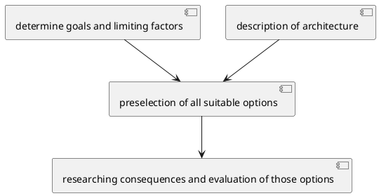

#architecture #cheat #web

### Requirements & Considerations
[Software Architecture](//architecture/Software%20Architecture.md) is mostly based on [three pillars](/architecture/analysis/three%20pillars%20of%20architecture.md) (due to CPSA)
- [functional requirement](/functional%20requirement)s
	- *"Is something writeable as a user story?"*
- [quality requirements](/architecture/analysis/quality%20requirements.md) (non-functional requirements)
- [limiting factors](/limiting%20factors)
	- *"Normally just facts!"*

Use [design principles](/architecture/design%20principles/design%20principles.md) and [software architecture patterns](/architecture/patterns/software%20architecture%20patterns.md) to define a possible solution.

See also [Web Architecture Layers](/architecture/requirements/Web%20Architecture%20Layers.md)

Chosing a [REST](/techstack/network/REST.md)ful style, see [here](/https://letmegooglethat.com/?q=awesome+REST)
