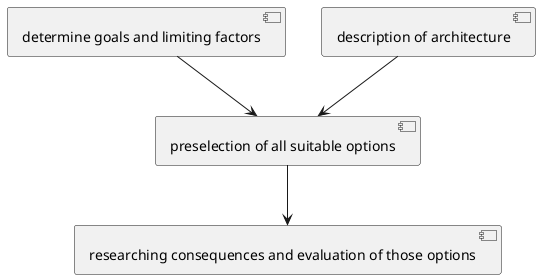

#architecture #cheat #web

### Requirements & Considerations
[[Software Architecture]] is mostly based on [[three pillars of architecture|three pillars]] (due to CPSA)
- [[functional requirement]]s
	- *"Is something writeable as a user story?"*
- [[quality requirements]] (non-functional requirements)
- [[limiting factors]]
	- *"Normally just facts!"*

Use [[design principles]] and [[software architecture patterns]] to define a possible solution.

See also [[Web Architecture Layers]]

Chosing a [[REST]]ful style, see [here](https://letmegooglethat.com/?q=awesome+REST)
