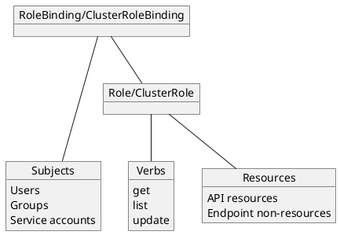

#k8s #kubernetes #cloud #access #security #authentication #authorization 

**RBAC** := role based access control

Extends [Cloud IAM](/techstack/gcp/Cloud%20IAM.md) and consists of three concepts
1. Who -> subjects
2. Which -> resources
3. What -> verbs

All three can be connected to [RoleBinding](/RoleBinding)
Resources and Verbs can be combined to [Role](/Role)



RBACs can be assigned on project, cluster or namespaces level
```yaml
apiVersion: rbac.authorization.k8s.io/v1
kind: Role
metadata:
	namespace: default
	name: demo-role
rules:
	- apiGroups: [""]
	  resource: ["pods"]
	  verbs: ["get", "list", "watch"]
```
- rules are only additive!

```yaml
apiVersion: rbac.authorization.k8s.io/v1
kind: ClusterRole
metadata:
	name: demo-role
rules:
	- apiGroups: [""]
	  resource: ["storageclasses"]
	  verbs: ["get", "list", "watch"]
```

### Attaching roles to [RoleBinding](/RoleBinding)
```yaml
apiVersion: rbac.authorization.k8s.io/v1
kind: RoleBinding
metadata:
	namespace: default
	name: demo-rolebinding
subjects:
- kind: User
	name: "joe@example.com"
	apiGroup: rbac.authorization.k8s.io
roleRef:
	kind: Role
	name: demo-role
	apiGroup: rbac.authorization.k8s.io
```

### Attaching roles to [ClusterRoleBinding](/ClusterRoleBinding)
```yaml
apiVersion: rbac.authorization.k8s.io/v1
kind: ClusterRoleBinding
metadata:

	name: demo-clusterrolebinding
subjects:
- kind: User
	name: "admin@example.com"
	apiGroup: rbac.authorization.k8s.io
roleRef:
	kind: ClusterRole
	name: demo-clusterrole
	apiGroup: rbac.authorization.k8s.io
```