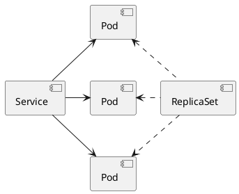

#gcp #cloud #kubernetes #k8s 

ReplicaSet object automates the creation and management of [pod](/techstack/gcp/pod.md) replicas. 
- represents a group of pod replicas
- replicas are exact copies of a [pod](/techstack/gcp/pod.md)

