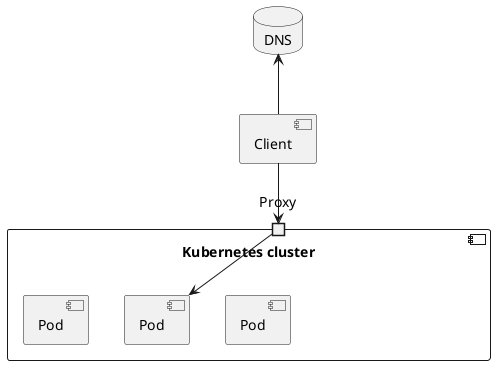

#gcp #k8s #kubernetes #cloud 

- the component that handles incoming [[HTTP]] [[request]]s and forwards it to the [[service]]
- proxy configuration typically contains a list of [[virtual host]]s and, for each, a list of [[Endpoints]] [[IP]]s
- the proxy uses this information to route the request to an endpoint such as a [[pod]] based on the request path and headers

#### Authorization with Reverse Proxy

#### Example
- [[LoadBalancer]]
- [[firewall]]
- web server [[Apache]], [[techstack/network/Nginx|Nginx]] 