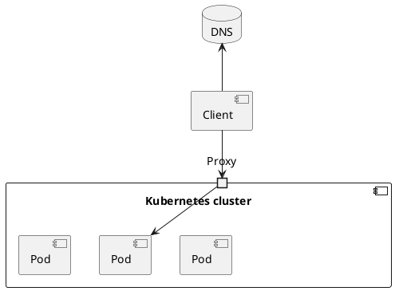

#gcp #k8s #kubernetes #cloud 

- the component that handles incoming [HTTP](/techstack/network/HTTP.md) [request](/request)s and forwards it to the [service](/techstack/gcp/service.md)
- proxy configuration typically contains a list of [virtual host](/virtual%20host)s and, for each, a list of [Endpoints](/Endpoints) [IP](/IP)s
- the proxy uses this information to route the request to an endpoint such as a [pod](/techstack/gcp/pod.md) based on the request path and headers

#### Authorization with Reverse Proxy

#### Example
- [LoadBalancer](/techstack/k8s/LoadBalancer.md)
- [firewall](/firewall)
- web server [Apache](/Apache), [Nginx](/techstack/network/Nginx.md) 